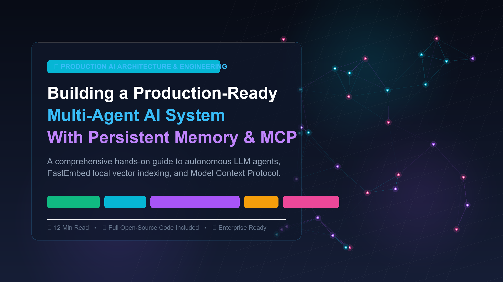
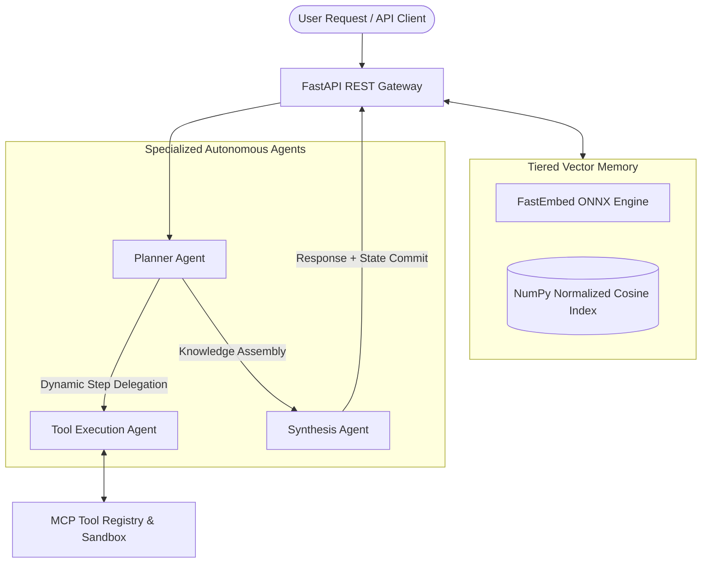

<div align="center">



# Production-Ready Multi-Agent AI System
### Persistent Semantic Memory • Model Context Protocol (MCP) • Local FastEmbed

[](https://github.com/Odessacool1/multi-agent-memory-system/actions)
[](https://www.python.org/downloads/)
[](https://fastapi.tiangolo.com)
[](https://github.com/qdrant/fastembed)
[](https://opensource.org/licenses/MIT)
[](https://medium.com/@skyair/building-a-production-ready-multi-agent-ai-system-with-persistent-memory-mcp-and-fastembed-in-6463b5b0c903)

</div>

---

## 📖 Overview

A reference architecture and production-grade implementation of an **autonomous multi-agent system** featuring:
1. **Tiered Semantic Memory:** Fast local vector indexing powered by ONNX runtime (`fastembed`), bypassing third-party embedding API rate limits.
2. **Model Context Protocol (MCP) Bridge:** Standardized, schema-validated tool execution with structured JSON outputs and error boundaries.
3. **Asynchronous Multi-Agent Swarm:** Decoupled Planner, Tool Executor, and Knowledge Synthesizer agents.
4. **REST API & Containerization:** Built-in FastAPI endpoints, Swagger documentation, Dockerfile, and Docker Compose configuration.

> 📚 **Accompanying Deep-Dive Article:**  
> Read the complete architectural breakdown on [Medium](https://medium.com/@skyair/building-a-production-ready-multi-agent-ai-system-with-persistent-memory-mcp-and-fastembed-in-6463b5b0c903).

---

## 🏛 Architecture



---

## 🚀 Quickstart

### 1. Clone & Install Dependencies

```bash
git clone https://github.com/Odessacool1/multi-agent-memory-system.git
cd multi-agent-memory-system

# Create virtual environment
python -m venv venv
source venv/bin/activate  # Windows: venv\Scripts\activate

# Install requirements
pip install -r requirements.txt
```

### 2. Run Interactive CLI Demo

```bash
python main.py
```

### 3. Launch FastAPI REST Service

```bash
uvicorn src.api:app --reload --host 0.0.0.0 --port 8000
```
Open interactive Swagger UI at: `http://localhost:8000/docs`

---

## 🐳 Docker Deployment

```bash
# Build and run with Docker Compose
docker compose up --build -d

# Inspect service logs
docker compose logs -f
```

---

## 🧪 Running Tests

```bash
pytest -v tests/
```

---

## 📡 API Reference

| Method | Endpoint | Description |
| :--- | :--- | :--- |
| `GET` | `/health` | Service health status and memory index statistics |
| `GET` | `/tools` | List all registered MCP tool manifests and schemas |
| `POST` | `/workflow/execute` | Dispatch an autonomous agent execution workflow |
| `POST` | `/memory/add` | Insert and vector-index a new semantic memory record |
| `GET` | `/memory/search` | Query stored vector memory with cosine similarity |

---

## 👨‍💻 Author

- **GitHub:** [@Odessacool1](https://github.com/Odessacool1)
- **Medium:** [@skyair](https://medium.com/@skyair)
- **LinkedIn:** [odesacool](https://www.linkedin.com/in/odesacool/)
- **X / Twitter:** [@ETHassociation](https://x.com/ETHassociation)

---

## 📄 License

This project is licensed under the [MIT License](LICENSE).
